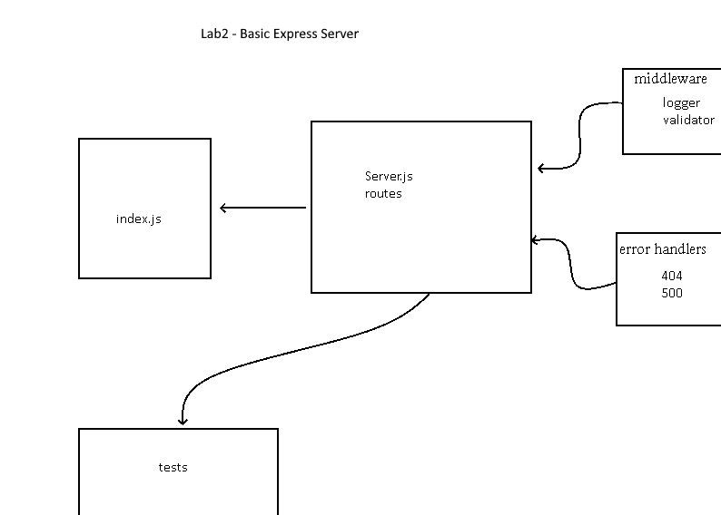

# basic-express-server
created by dario v

## Description
Dynamic API Phase 1: Build your core, standards compliant Express server

## links to application deployment

## routes
- http get
  + path /person
    * responds with query name of person

## uml
